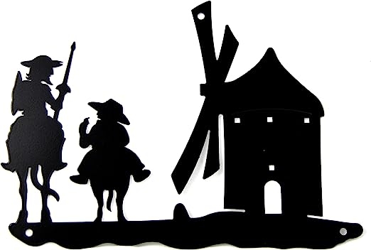

# Proyecto N°1: Landing de ventas

Proyecto para la UDD basado en un negocio de comida de mascotas.

****

## 1. Navbar

Posee links para dirigirse al home, al catálogo, entrar a una cuenta ya hecha o crear una nueva en su defecto.

## 2. Selector de páginas

Se divide en dos mitades para dirigirse a catálogos personalizados en caso de querer ver solo productos para perros o solo productos para gatos.

## 3. Catálogo de productos

Se seleccionó tres productos dentro de tarjetas con precio con el pretexto de que son productos muy buscados por los usuarios.

## 4. Jumbotron

Lleva el logo de la marca, su nombre, una frase que da a conocer de que se trata la página y un formulario

Agregar tecnologías usadas